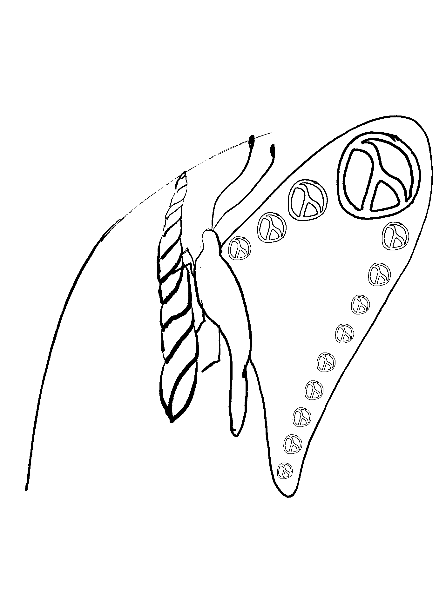
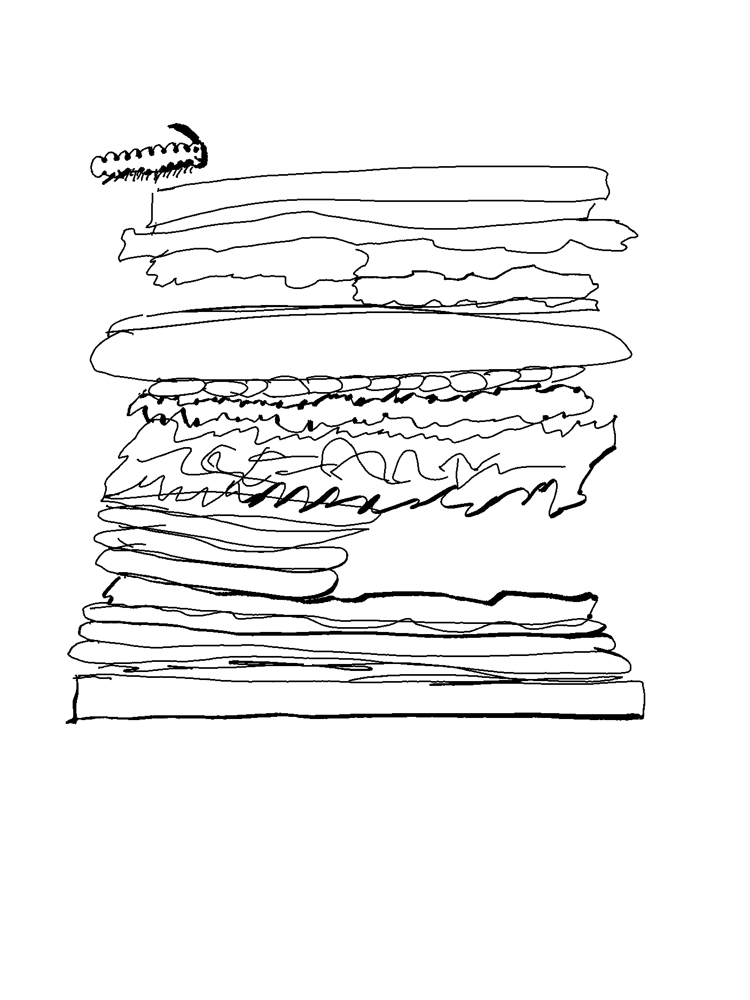

# Papillon

An interceptor library for Clojure.




## About

This library was inspired by the mix of Interceptor patterns from:

 - Pedestal's [Interceptors](http://pedestal.io/reference/interceptors),
 - Metosin's [Sieppari](https://github.com/metosin/sieppari),
 - Eric Normand's [A Model of Interceptors](https://lispcast.com/a-model-of-interceptors/),
 - and LambdaIsland's [Interceptors, part 1, concepts](https://lambdaisland.com/episodes/interceptors-concepts).

### Why this library?

We use Clojure(Script) on AWS Lambdas where a number of them are triggered asynchronously without a HTTP request.  The goal of this library is to advocate for the idea of interceptors, while providing a way to use them that are independent from HTTP and applicable in a broader range of scenarios.

A side goal of this is to provide the core of the execution of an interceptor queue, while keeping it open enough that it can be composed with other complimentary libraries without locking the consumer into using specific libraries required for other aspects, such as picking a logging library.

### Goals

#### Clojure Common

As mentioned above, we run ClojureScript on Node runtime for our AWS Lambdas, so we needed a solution that covers both Clojure and ClojureScript.

While we are currently only targeting Clojure and ClojureScript support, as that is what we use in our deployments at work, our goal is to stick to Clojure core a much as possible to help keep the Papillon available across as many of the different Clojure runtimes as possible (e.g. Clojure.NET, ClojurErl, ClojureDart, Babashka, and more would also be welcomed).

#### Interceptor focused

Pedestal interceptors are fantastic, but they are part of Pedestal, and while we could have used Pedestal’s interceptor namespace only, it does have dependencies on logging in Pedestal, and the interceptors in Pedestal are not quite as isolated from the rest of Pedestal as we would have liked.

#### Decouple the interceptors from HTTP requests.

Sieppari was more focused on Interceptors only, but was based on the idea of a Request/Response model.

With our goal to have interceptors be the prevalent pattern in our AWS Lambdas, we needed something that would fit with both the HTTP style of synchronous AWS Lambdas, as well as the asynchronous AWS Lambdas that consume their items from SQS queues, the idea of contorting a SQS message into a HTTP Request/Response was something we wanted to avoid.

#### Minimal

We focused on what seemed to be the core of interceptors which is having an execution chain of interceptors to run, and running a context map through that chain and back out.

We have tried to leave out most everything else, as we found the interceptor chains can easily be modified to include many orthogonal concerns, allowing us to decomplect the interceptor execution from other useful but separate concerns.

One example of something we have left out is logging. While it is useful to log the path through the interceptor chain, and modifications to the execution chain, we didn’t want to pick a logging library that consuming applications would inherit our decision on.

#### Data First

We also found that given the concept of the interceptor chain being just data, we could get logging (and various other concerns, e.g. benchmarking, tracing, etc.), included by manipulating the interceptor chain using interleave with a repeated sequence of a logging specific interceptor.

This ability to treat both the context as data and the control flow as data, allowed us to keep the core flow of domain logic as interceptors, distinct from logging and other developer related concerns, allowing us to highlight the core context.

Given that the control flow is data, and available on the context, it allowed us to play with ideas like setting up support for a Common Lisp style Condition System as seen in the examples folder.

#### Clojure Core Libraries Based

We stuck with core.async and the ReadPort as our asynchronous mechanism. If we are a library, we didn’t want to commit you to a library because you use Papillon. Clojure (JVM) already has various asynchronous constructs that work with ReadPort and we piggy-backed on ReadPort in ClojureScript land to allow you to use JavaScript Promises as a ReadPort.

The Goal was to give you something that would work out of the box with the various tools to do asynchronous programming that Clojure and ClojureScript give you without making you implement yet another protocol to adapt to.

Get more discussion on Interceptors starting again
We don’t expect that this will become the next big hit and everyone will start using this in their code, but we do hope that by publishing and promoting “Yet Another Interceptor Library”

> Side Note:  I almost did name it yail (Yet Another Interceptor Library), but it didn't feel like it hit 'yet another' level so happy to keep that one available for someone else to use in the hope that the idea of interceptors gets to that point 🤞.

Those of us in our group who were pushing this project forward think interceptors are a valuable and a “well kept secret” of the Clojure ecosystem, and would love to see more usages of them in the community.

We also would love to see some more abuses of interceptors as well, because it helps find the edges of what can(not) and should (not) be done with them.

## How it works

### Summary

If Either Monads are burritos, then Interceptor Chains are like Dagwood sandwiches for a hungry caterpillar.

The interceptor chain pattern is an execution pipeline that runs forward to the end of the chain, and then turns around and goes back out the pipeline in reverse order, allowing you to specify things like how to clean up resources on the way back out of the pipeline.

This is the hungry caterpillar idea.

The caterpillar starts at the top of the sandwich, and eats its way down through all the layers of the sandwich, some of which may be empty like the holes in some delicious Swiss cheese, or items only on one side of the sandwich; then when the caterpillar has exited the bottom, it chomps its way back up to the top on the other half of the sandwich resulting in a well fed caterpillar that is now a beautiful butterfly.

Sometimes things go wrong, and the caterpillar eats something that didn't agree with it making it sick.  In that case, the caterpillar upon exiting that layer of the sandwich scurries to the outside of the sandwich, and starts walking up the outside crust taking nibbles of things here and there until something settles its indigestion, at which point it goes back into the sandwich once again, and continues to eat, or otherwise climbing back up the outside of the sandwich to the top where you get a sick caterpillar waiting for you.



### The Spec

Interceptors are represented as a map with the optional keys of `:enter`, `:leave`, and/or `:exit`.  None of the keys are required to be on an interceptor map, and if no truthy value for the key being checked is found on the interceptor map, the executor will continue its processing skipping over the interceptor for that stage.

The idea of sticking to a map instead of a record is that if the interceptor is a map, consumers can attach any other data to the interceptor, which the executor will ignored instead of actively discarding when converting to a record, allowing the extra keys and values on the interceptor map to be accessible while it exists on the queue or the stack in the context.

#### Completing the Enter Stage

##### Empty Queue of Interceptors

The enter stage is considered completed when there are no more interceptors on the queue, and will start processing the interceptor chain from the stack.

##### Reduced Context

If the returned context from an `:enter` function is a reduced value, this is treated as a signal to stop further processing of the :enter chain and proceed to start processing the interceptor stack through the `:leave` stage.

##### Raising, or Returning, an Error

When an interceptor function throws or returns an error, e.g. ExceptionInfo, Throwable in Clojure, js/Error in Clojurescript, the queue is cleared from the context, the error is added under the `:lambda-toolshed.papillon/error` key, and the stack starts getting processed through the `:error` stage.

The interceptor stack will continue to be consumed through the `:error` stage until the error is marked as resolved by removing the `:lambda-toolshed.papillon/error` key from the context map.  Once there is no error in the context, processing will proceed through the `:leave` stage until another error is returned or gets thrown in a synchronous interceptor.

#### The Context map

##### Keys

| key                                   | description                                                                                                                                                                                                                                                                                                                                                                                                                |
| ------                                | --------------                                                                                                                                                                                                                                                                                                                                                                                                             |
| `:lambda-toolshed.papillon/queue` | The queue of interceptors.  This gets initialized with the interceptors passed to `execute`, but can be managed if you know what you are doing.                                                                                                                                                                                                                                                                            |
| `:lambda-toolshed.papillon/stack` | The stack of interceptors for traversing back through the chain of interceptors encountered.                                                                                                                                                                                                                                                                                                                               |
| `:lambda-toolshed.papillon/error` | This key should have the error information associated with it.  This key signifies we are in an error state, and interceptors with `:error` key will be processed, either for them to clean up some state (open connections, etc.) or attempt to handle and resolve the error and return nicely.  A few examples might be: turn the error into 500 HTTP response; put original message and error onto an error queue; etc. |


### Asynchronous Interceptors

The executor handles Asynchronous items by checking to see if the return value of an interceptor is a `ReadPort`.

#### Errors in asynchronous interceptors

To signal an error in an asynchronous interceptor, the executor cannot just catch an exception, as the error occurs in a different timeline from where the code that started the process lives, so any catch for an exception has fallen out of scope.

Because of this, the Interceptor library expects the asynchronous interceptors to catch any errors themselves and return the error as its return value.

After the executor "unwraps" the asynchronous result, if it finds an error in the unwrapped result then it will add the error to the context under `:lambda-toolshed.papillon/error` key, as if it had been caught from a synchronous interceptor.

#### ClojureScript and JavaScript interop

If you are in ClojureScript, and are in Promise land (Editors Note: this is drastically different from The Promised Land, and the two should not be confused), you can import the namespace `lambda-toolshed.papillon.async` which will have a Promise implement `ReadPort` and turn the Promise into something that can be read in the same way as a channel.

This is done by using `cljs.core.async.interop/p->c`, taking the `PromiseChannel` returned from that and turning it into a channel with the result being a single item on the channel.

## Examples and Other ways to extend usage

### Interceptor Tracing/Timing

Because the interceptor executor takes a sequence of interceptors to build the processing queue from, we can manipulate that before execution time as it is data.  In the example below, if we have tracing enabled, we interleave a tracing interceptor, could be a timing capture interceptor, with the standard interceptors we are expecting to process as part of the interceptor chain.

And example of this is found in [examples/example.cljc](./examples/example.cljc), and the `with-tracing` function that interleaves a tracing interceptor with a sequence of interceptors when in "debug" mode.

There is also an example of another tracing system that is a bit more advanced in [examples/dynamic_tracing.cljc](examples/dynamic_tracing.cljc), which will wraps every following interceptor in the queue with tracing/timing functions, if the interceptor map is marked with meta-data.

### Nesting Interceptor Executions

By decoupling interceptors and keeping them generic, it opens up the possibility that you could nest interceptor chains within a larger context.

```clojure

(def some-nested-ixs
 [ ;;; some interceptor chain goes here
 ])

(def other-nested-ixs
 [ ;;; some other interceptor chain goes here
 ])

(defn fork
  [starting-ctx & ix-chains]
  ;; fork things off
  (let [successes-chan (chan)
        errors-chan (chan)]
    (doseq [ixs ix-chains]
      (evaluate starting-ctx
                ixs
                (fn (ctx) (put! successes-chan ctx))
                (fn (ctx) (put! errors-chan ctx))))
    [successes-chan errors-chan]))

(defn join
  "Join the results of calling fork to split off the channel
   and stitch them back up as needed"
 [& args]
 ;; join things back up (channels, etc.)
 )

(defn fork-join
 "Spin up mulitple interceptor executions (in channels)
  to give concurrency/asynchornicity and then join them
  back up together"
 [ctx]
 (join (fork (sub-context) some-nested-ixs other-nested-ixs)))

(def fork-join-ix
  {:enter fork-join})

```

While this is not a recommendation to do such nesting, it is meant to highlight additional possibilities of using the interceptor pattern decoupled from the HTTP Request/Response concept.

The decoupling allows the interceptor pattern to be used in a similar way that the Either monad type in ML family of languages can be used in functions where it becomes useful, instead of only at the outer most entry points of your application.

### A Possible Condition system

As interceptors themselves are maps, one could have any other sets of keys on the map used in the Interceptor queue, and in keeping with Clojure style, we only care about those keys we want.

By giving a contract for the interceptor and interceptor execution one could implement something similar in spirit to Common Lisp's Condition System by being able to look at the Interceptor Stack of calls, and walk back up the Stack without consuming it the way raising an error does.

Because you have visibility to the stack and the queue, as they are keys in the context map, you could walk up the stack looking for interceptors that have the key that was received as a "signal", and invoke a function associated with that key to attempt to handle the signal.  This allows you to unwind the stack, without unwinding the stack, because, as long as you don't return the modified context, you are working on a persistent data structure, and any modifications to the stack are a copy of the stack scoped to your usage.  Persistent Data Structures FOR THE WIN!!

A basic example of this can be found in [examples/condition_system.cljc](./examples/condition_system.cljc), along with and advanced condition system that uses derived keywords, and the derivation hierarchy of a keyword signal.

## Sponsored by Guaranteed Rate


